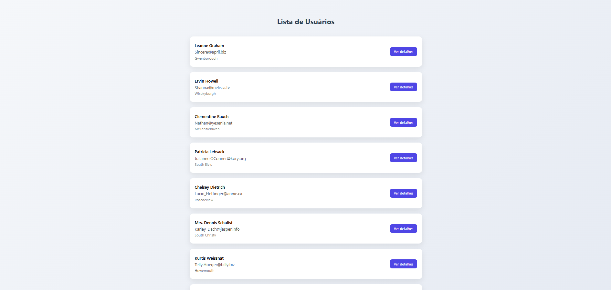
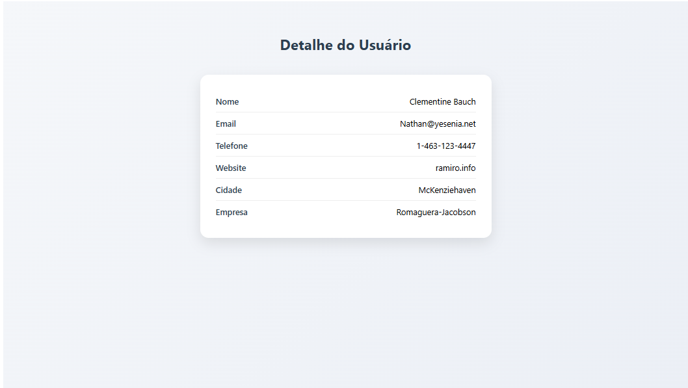

# AtividadeAngular

Preview Tela de Usuários


Preview Detalhes de Usuário


# O que é uma rota dinâmica?

Uma rota dinâmica é uma rota que contém parâmetros variáveis na URL, permitindo que o mesmo componente seja reutilizado para diferentes dados.
Em vez de criar uma rota diferente para cada item, você cria uma única rota com um parâmetro.
No Angular, rotas são definidas no arquivo "app.routes.ts."

```typescript
{ 
  path: 'users/:id', 
  component: UserDetail 
}
```

O :id é um parâmetro dinâmico.
Isso significa:

/users/1

/users/2

/users/999

Tudo isso vai carregar o mesmo componente, mas com valores diferentes.

```typescript
this.route.paramMap.subscribe(params => {
      const idParam = params.get('id');
      const id = Number(idParam); 
      [...]
```
E aqui é onde ele está pegando o valor do paramêtro utilizando "ParamMap"

# O que é ParamMap
paramMap é um Observable fornecido pelo ActivatedRoute que contém os parâmetros dinâmicos da rota ativa.
Ele é a forma oficial do Angular de acessar parâmetros de rotas dinâmicas, permitindo que um mesmo componente seja reutilizado para diferentes dados baseados na URL.
Ele é usado quando a rota possui parâmetros definidos com ":".

# Onde foi usado "Observable" e por quê?

Nesse projeto o "Observable" foi utilizado no arquivo " user.ts " dentro do "export class UserService":

```typescript
export class UserService {

  private api = 'https://jsonplaceholder.typicode.com/users';

  constructor(private http: HttpClient) {}

  listarUsuarios(): Observable<User[]> {
    return this.http.get<User[]>(this.api);
  }

  buscarUsuarioPorId(id: number): Observable<User> {
    return this.http.get<User>(`${this.api}/${id}`);
  }

}
```
O Observable foi utilizado porque a aplicação está buscando uma lista de usuários na internet, através de uma API. Como esses dados não estão salvos diretamente no sistema e precisam ser carregados de um servidor externo, a resposta não chega imediatamente.

Requisições feitas pela internet levam um pequeno tempo para retornar, por isso são chamadas de operações assíncronas. Para que a aplicação não fique travada esperando essa resposta, o Angular utiliza Observable, que permite que o sistema continue funcionando normalmente enquanto aguarda os dados.

Quando a resposta da API chega, o Observable “entrega” as informações para o componente, que então pode exibi-las na tela.


